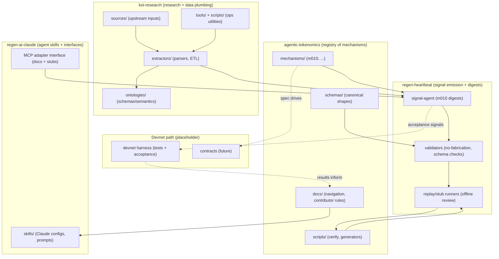

# Stack Map

This diagram is a **navigation aid** for humans and agents. It shows **where work belongs** and **how repositories reference each other** without copying large chunks across repos.

## Diagram

## How to use this

- If you are changing **mechanism specs/schemas/reference implementations**, work in **agentic-tokenomics** under `mechanisms/` and `schemas/`.
- If you are changing **data ingestion / extractors / ontologies**, work in **koi-research** under `extractors/` and `ontologies/`.
- If you are changing **agent configuration and tool interfaces**, work in **regen-ai-claude** (skills + MCP adapter docs/stubs).
- If you are changing **signal generation / replay / validation**, work in **regen-heartbeat**.

## Review strategy

To keep PRs reviewable:
- Prefer **one subtree per PR** (e.g., `docs/` only, or `mechanisms/m010-...` only).
- Link to related repos/docs rather than duplicating content.

## Repo links

- agentic-tokenomics: https://github.com/regen-network/agentic-tokenomics
- koi-research: https://github.com/regen-network/koi-research
- regen-ai-claude: https://github.com/gaiaaiagent/regen-ai-claude
- regen-heartbeat: https://github.com/gaiaaiagent/regen-heartbeat
