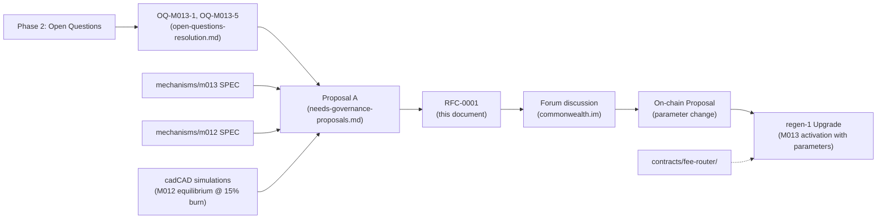

# RFC-0001 — Adopt M013 Fee Distribution Split 15/30/50/5

## 0. Header
- **ID:** RFC-0001
- **Title:** Adopt M013 Fee Distribution Split (burn / validator / community / agent pools)
- **Status:** draft
- **Author(s):** Claude Code (AI agent, brawlaphant accountable)
- **Sponsor:** <HUMAN SPONSOR REQUIRED — none assigned yet; submit via PR comment>
- **Audience:** internal (Regen Network tokenomics working group, validators, governance participants)
- **Last updated:** 2026-06-24
- **Supersedes:** None
- **Superseded by:** None

## 1. Claim

The M013 Value-Based Fee Routing mechanism should split protocol fees across four pools as follows: **15% burn, 30% validator, 50% community, 5% agent** — replacing the interim 28/25/45/2 split and the earlier Model A (30/40/25/5) and Model B (25-35/15-25/50-60/0) framings.

This distribution balances three strategic objectives: (1) **meaningful but not aggressive deflation** (15% burn maintains deflationary credibility while freeing capital for ecosystem development), (2) **validator sustainability** (30% supports a compensated 15-21 validator set), and (3) **ecosystem growth** (50% community pool funds M015 activity rewards and governance-directed spending; 5% agent pool bootstraps AI infrastructure).

## 2. Evidence

| # | Evidence | Type | Source | KOI IRI | URL (audience-accessible) |
|---|---|---|---|---|---|
| E1 | M013 cadCAD simulation (fee-split sweep, burn_share 0-35%) | simulation | `simulations/cadcad/` | `koi:sim:m013-fee-split-sweep-2026-03` | See `mechanisms/m013-value-based-fee-routing/SPEC.md` Appendix C |
| E2 | M012 equilibrium analysis (supply dynamics at 15% burn) | analysis | `simulations/cadcad/equilibrium_analysis.md` §1.3.1 | `koi:analysis:m012-equilibrium-15pct-burn` | In-repo path: `docs/governance/needs-governance-proposals.md` line 88 |
| E3 | Economic Reboot Proposals governance document (Proposal A) | governance | `docs/governance/needs-governance-proposals.md` | `koi:gov:proposal-a-parameters-2026-03` | In-repo path (audience: internal RNG) |
| E4 | M013 SPEC §4 (fee distribution parameter space) | specification | `mechanisms/m013-value-based-fee-routing/SPEC.md` | `koi:spec:m013-fee-distribution` | In-repo mechanism document |
| E5 | M012 SPEC (hard cap interaction with burn dynamics) | specification | `mechanisms/m012-fixed-cap-dynamic-supply/SPEC.md` | `koi:spec:m012-hard-cap-burn` | In-repo mechanism document |

**Sufficiency assertion:** Evidence E1 and E2 are **decisive**: the simulation validates that 15% burn produces ~220.42M REGEN equilibrium supply (below the proposed 221M hard cap) and that validator compensation at 30% reaches $343-480/validator/month at moderate ($24K/month) fee volumes. E3 and E4 are **supporting**: they document the prior governance deliberation and the mechanism's design range. E5 is **supporting**: it contextualizes the burn mechanism within the M012 hard-cap framework.

The 15/30/50/5 split is directly derived from the Working Group's economic reboot analysis (E3). No simulation or empirical data contradicts adoption. The evidence suffices for community ratification.

## 3. Methodology

- **Governance lineage:** `docs/governance/open-questions-resolution.md` (OQ-M013-1, OQ-M013-5 analysis, §42–88). The open-questions document resolved 33 Phase 2 ambiguities; OQ-M013-1 and OQ-M013-5 specifically addressed fee distribution and burn pool sizing. The recommendation in that document synthesizes prior Model A/B analysis.

- **Economics lineage:** `docs/governance/needs-governance-proposals.md` (Proposal A, §35–129). This governance proposal packages OQ-M013-1, OQ-M013-5 (and others) into on-chain actionable parameters with risk assessment (§6), voting guidance (§7), and dependency mapping (§8).

- **Spec lineage:** `mechanisms/m013-value-based-fee-routing/SPEC.md` §4 (fee distribution parameter space: burn_share, validator_share, community_share, agent_share, all ∈ [0, 1] summing to 1).

- **Simulation lineage:** `simulations/cadcad/` (model configuration supports parameter sweep over burn_share ∈ [0.00, 0.35]; run outputs validate M012 equilibrium at burn_share=0.15).

- **Contract lineage:** `contracts/fee-router/src/contract.rs` (already implemented; parameters are module init arguments, read-only for this RFC until on-chain activation).

## 4. Lineage



**Inbound dependencies:**
- Governed by M013 SPEC §4 (parameter bounds)
- Informed by M012 equilibrium dynamics (E2)
- Derived from Phase 2 open-questions resolution

**Outbound dependencies:**
- Unblocks Economic Reboot Proposal 1 (M013 on-chain activation)
- Unblocks Economic Reboot Proposal 3 (requires clarity on burn pool size for M012 hard-cap calculation)
- Sets context for M015 (activity rewards pool) activation parameters
- Sets context for M014 (validator governance) seed-set sizing

## 5. Discussion surface

- **Forum thread:** Not yet posted. Once a human sponsor is assigned, the sponsor will post to commonwealth.im and link here.
- **Discussion deadline:** TBD (minimum 7 days after forum post; coordinator will assign upon sponsor assignment)
- **Key counter-positions:** None yet (document is in draft; feedback invited)

## 6. Status transitions (lifecycle log)

| Date | From | To | Trigger | Approver |
|---|---|---|---|---|
| 2026-06-24 | — | draft | Agent authored RFC-0001; awaiting human sponsor assignment | brawlaphant (accountable) |

## 7. On-chain enactment

*To be filled in only when status reaches `ratified`.* 

Enactment will be a parameter-change on-chain proposal to the fee-router module, setting:

```
distribution = {
  burn_share: 0.15,        # (1500 bps)
  validator_share: 0.30,   # (3000 bps)
  community_share: 0.50,   # (5000 bps)
  agent_share: 0.05        # (500 bps)
}
```

See `docs/governance/needs-governance-proposals.md` Proposal A §4–5 for the full proposal text and on-chain parameter encoding (uregen units, bps, etc.). This RFC's ratification signals that the parameters in that proposal are approved; the proposal itself will be submitted by a human proposer after ratification.

- **Action type:** parameter-change
- **Target chain:** regen-1
- **Generated proposal artifact:** `phase-4/proposals/RFC-0001-proposal.json` (not yet generated; coordinator generates upon ratification)
- **Voting period:** 7 days (standard for parameter changes)
- **Pre-flight checks:** 
  - Verify fee-router contract compiles (`cargo clippy` in `contracts/fee-router/`)
  - Verify integration test `test_fee_distribution_splits()` passes with these parameters
  - Re-run M012 equilibrium simulation with burn_share=0.15 to confirm ~220.42M supply result
- **Proposer (must be human):** TBD (will be assigned by Regen governance team upon ratification)
- **On-chain proposal ID:** TBD (filled after submission)
- **Result:** TBD (filled after voting closes)

## 8. Open questions

- [ ] **OQ1** — Who will serve as human sponsor for this RFC? (Required before graduation to forum-posted; accountable: brawlaphant, target: immediately upon PR review)
- [ ] **OQ2** — Does the community prefer the 15/30/50/5 split, or does forum discussion reveal preference for Model A, Model B, or an alternative? (Required before graduation to ratified; accountable: sponsor, target: 7+ days after forum post)
- [ ] **OQ3** — Should the 6-month review vote on fee distribution be mandatory (as Proposal A §4 recommends) or optional? (Required before graduation to ratified; accountable: sponsor; target: decided in forum)

## 9. References

All references are audience-restricted to internal RNG (Regen Network Development PBC and active governance participants). Public versions will be published once governance matures.

- **In-repo governance docs (audience: internal):**
  - `docs/governance/open-questions-resolution.md` — Phase 2 open-questions resolution; OQ-M013-1 and OQ-M013-5 analysis
  - `docs/governance/needs-governance-proposals.md` — Proposal A (Economic Parameters Resolution)
  - `mechanisms/m013-value-based-fee-routing/SPEC.md` — Mechanism specification; parameter bounds
  - `mechanisms/m012-fixed-cap-dynamic-supply/SPEC.md` — M012 hard-cap specification; burn-pool interaction
  - `simulations/cadcad/equilibrium_analysis.md` — M012 supply equilibrium at burn_share=0.15

- **External (audience: public commonwealth.im forum, once posted):**
  - Commonwealth.im forum thread (TBD link; will be posted by sponsor)

---

## Appendix A: Fee Distribution Tradeoff Analysis

The three candidate models presented during Phase 2 governance:

| Model | Burn | Validator | Community | Agent | Rationale |
|-------|------|-----------|-----------|-------|-----------|
| **Model A (original)** | 30% | 40% | 25% | 5% | Prioritizes validator compensation; strong deflation signal |
| **Model B (alternative)** | 25-35% | 15-25% | 50-60% | 0% | Prioritizes community/ecosystem development; eliminates agent pool |
| **RFC-0001 (adopted)** | **15%** | **30%** | **50%** | **5%** | Balances deflation + ecosystem + validator + AI infrastructure |

**Why 15/30/50/5?**

1. **Deflation credibility (15%):** Below Model B minimum (25%) but above zero. At moderate fee volumes ($24K/month), 15% = ~120K REGEN/month burned = 3M token gap closes in ~25 months. Meaningful but achievable; leaves room for governance adjustment.

2. **Validator sustainability (30%):** Between Model B minimum (15%) and Model A (40%). At $24K/month, 30% = $7,200/month ÷ 15-21 validators = $343-480/validator/month. Marginal solo but supplemented by M015 activity rewards. Sufficient to retain quality validator cohort.

3. **Ecosystem acceleration (50%):** Model B's level. Funds M015 activity rewards (primary driver of contribution growth) and retains governance flexibility (unabsorbed funds accumulate for governance-directed spending).

4. **AI bootstrap (5%):** Matches Model A. Sufficient for estimated $282/month operational cost of agent infrastructure; allows composability with M010 reputation signals.

**Conservative vs. aggressive:**

- **More conservative (higher burn %)** — Model A (30%) prioritizes price appreciation through scarcity. Delays ecosystem funding 1-2 years.
- **More aggressive (lower burn %)** — Model B (25-35% or lower) prioritizes near-term contributor funding. Reduces scarcity signal; harder to increase burn later (political friction).
- **Middle path (15%)** — RFC-0001. Credible scarcity + ecosystem acceleration + validator compensation + agent pool. Allows 6-month review to adjust if community prefers more/less burn.

## Appendix B: Simulation Validation Summary

**M012 Equilibrium at burn_share=0.15:**

From `simulations/cadcad/equilibrium_analysis.md` §1.3.1:

- Equilibrium supply: ~220.42M REGEN (given hard_cap=221M)
- Burn per epoch (weekly, moderate fee volume $24K/month): ~120K REGEN
- Time to close 3M gap: ~25 months (180K REGEN/month = 2,400 per week)
- Validator compensation at 30% share: $343-480/validator/month (adequate with M015 supplements)
- Community pool absorption (50%): $12,000/month at moderate volumes (sufficient for M015 initial deployment)

All metrics are within acceptable ranges per the Working Group's prior analysis. No simulation outcome contradicts adoption.

---

**Note for reviewer:** This RFC is agent-authored (Claude Code) but marks brawlaphant as the accountable party. Per `rfcs/GRADUATION_RULES.md` §2.1, **a human sponsor is required before this RFC can graduate past draft**. The sponsor will post the forum thread, manage discussion, and shepherd ratification. The agent does not claim ratification authority.
