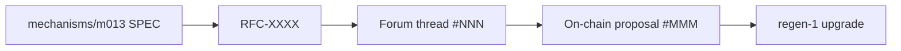

# RFC-XXXX — <Decisive title in active voice>

<!--
  Copy this file to rfcs/RFC-XXXX.md, replacing XXXX with the next sequential ID.
  Read rfcs/GRADUATION_RULES.md before authoring. Self-review against
  rfcs/schema/rfc-review-schema.yaml before requesting human review.
-->

## 0. Header
- **ID:** RFC-XXXX
- **Title:** <one-line title>
- **Status:** draft  <!-- draft | forum-posted | ratified | enacted | parked | withdrawn | superseded -->
- **Author(s):** <human or agent IDs; if agent-authored, name the human accountable>
- **Sponsor:** <human accountable for this RFC's progression — required, must be human>
- **Audience:** internal | partner | commons | public  <!-- determines reference accessibility gate strictness -->
- **Last updated:** YYYY-MM-DD
- **Supersedes:** <RFC-IDs, if any>
- **Superseded by:** <RFC-IDs, if any>

## 1. Claim

*One paragraph. The decisive proposition this RFC asserts. Not "we're exploring X" — that's a spec. RFCs make a claim that can be ratified or rejected. State it sharp.*

Example: "REGEN's fee router (M013) should split protocol fees 15/30/50/5 between burn / treasury / validator / community pool, replacing the interim 28/25/45/2 split, because <key reasons>."

## 2. Evidence

*Every claim has supporting evidence. Use the table below. Every evidence item must resolve for the audience tier declared in §0 (see the Reference Accessibility Gate in the workspace CLAUDE.md). KOI IRIs are preferred where available.*

| # | Evidence | Type | Source | KOI IRI | URL (audience-accessible) |
|---|---|---|---|---|---|
| E1 | <e.g., M013 cadcad simulation result> | simulation | simulations/M013/run-2026-04-20 | `koi:sim:m013-fee-split-2026-04-20` | <link> |
| E2 | <e.g., on-chain fee distribution data Q1 2026> | empirical | regen-network mainnet | `koi:onchain:fee-dist-q1-2026` | <link> |
| E3 | <e.g., forum discussion on prior split> | deliberative | commonwealth.im | `koi:forum:thread-NNN` | <link> |

**Sufficiency assertion:** *Why this evidence is sufficient for the claim. State explicitly which evidence is **decisive** (load-bearing for ratification) vs. **supporting** (corroborates but doesn't independently establish).*

## 3. Methodology

*How the claim was derived from the evidence. Cite the spec(s), simulation runs, contract behaviors, or analytic frameworks involved. This section is where the lineage to the **code chamber** lives — every methodology entry should resolve to a path in `mechanisms/`, `simulations/`, `contracts/`, or an external method (with KOI IRI).*

- **Spec lineage:** `mechanisms/m013-value-based-fee-routing/SPEC.md` §5.2
- **Simulation lineage:** `simulations/M013/scenarios/fee-split-sweep.py` (run hash `<sha>`)
- **Contract lineage:** `contracts/fee-router/src/contract.rs` (commit `<sha>`)
- **External methodology:** <name + KOI IRI>

## 4. Lineage

*Where this RFC sits in the broader pipeline. Both directions:*

- **Inbound:** specs / prior RFCs / claims this RFC depends on
- **Outbound:** RFCs / on-chain proposals / contract changes that depend on this one

## 5. Discussion surface

*How and where this RFC is being deliberated.*

- **Forum thread:** <commonwealth.im URL or "not yet posted">
- **Discussion deadline:** YYYY-MM-DD <!-- earliest date this RFC can graduate to ratified; minimum 7 days from forum-post -->
- **Key counter-positions raised:** <bulleted summary; updated as discussion proceeds; each must be addressed before graduating to ratified>

## 6. Status transitions (lifecycle log)

*Append-only log. Each transition is a row. Never edit prior rows. The graduation rules (`rfcs/GRADUATION_RULES.md`) define the criteria for each move.*

| Date | From | To | Trigger | Approver |
|---|---|---|---|---|
| YYYY-MM-DD | — | draft | author drafted | <author> |

## 7. On-chain enactment

*Filled in only when status reaches `ratified`. Must specify: (a) the type of on-chain action; (b) deterministic generation rules so the proposal text can be reconstructed from this RFC.*

- **Action type:** <param-change | text-proposal | software-upgrade | ecocredit-class | ...>
- **Target chain:** regen-1 | redwood-1 | other
- **Generated proposal artifact:** `phase-4/proposals/RFC-XXXX-proposal.json`
- **Voting period:** <e.g., 7 days, standard>
- **Pre-flight checks:** <unit tests, integration tests, simulation reruns required before submission>
- **Proposer (must be human):** <name>
- **On-chain proposal ID:** <filled after submission>
- **Result:** <PASSED | REJECTED | filled after voting closes>

## 8. Open questions

*Things that need resolution before this RFC graduates further. Each should have an owner and a target date. All must be resolved or explicitly carried as known limitations before graduating to ratified.*

- [ ] OQ1 — <description> (owner: <name>, by: YYYY-MM-DD)
- [ ] OQ2 — <description>

## 9. References

*Audience-accessibility-checked. No phantom references. If the §0 audience is `public`, only public URLs allowed. If `internal`, internal Drives are okay but unpack the substance inline. See the Reference Accessibility Gate in the workspace CLAUDE.md.*

- [E1] <link>
- [E2] <link>
- [E3] <link>
